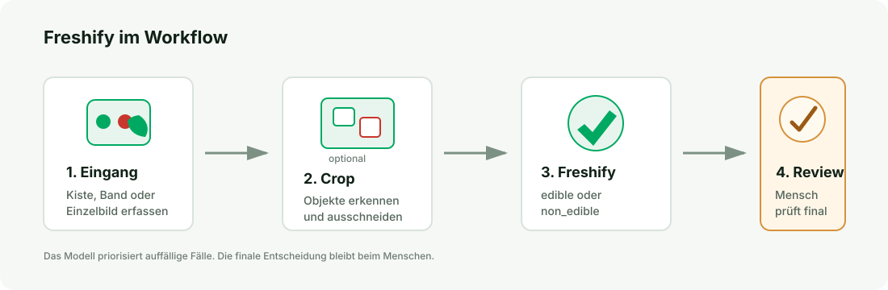

# Food Freshness Categorizer

Binäres Bildklassifikationsprojekt zur Bewertung von Lebensmittelbildern als `edible` oder `non_edible`.

Forschungsfrage: Kann ein leichtgewichtiges ML-Modell anhand ausschließlich visueller Merkmale in Bildern zuverlässig die Frische von Lebensmitteln klassifizieren?

Hier gehts zur [Demo](https://freshify.streamlit.app/) der Anwendung.

Die Entwicklung des Machine-Learning-Prototyps erfolgte iterativ entlang des CRISP-DM-Prozessmodells, insbesondere durch wiederholte Schleifen zwischen Business Understanding, Data Understanding, Data Preparation, Modelling und Evaluation.
<sub><span style="color:gray">
Chapman, P., Clinton, J., Kerber, R., Khabaza, T., Reinartz, T., Shearer, C., &amp; Wirth, R. (2000). <i>CRISP-DM 1.0: Step-by-step data mining guide</i>. CRISP-DM Consortium.
</span></sub>

## Business Case

Freshify ist als Assistenzsystem für die Vorsortierung im Tafel-/Wareneingang-Kontext gedacht. Das Modell trifft keine finale Wegwerfentscheidung, sondern markiert auffällige Lebensmittel für eine anschließende menschliche Prüfung. Im Standardworkflow wird das Gesamtbild als `edible` oder `non_edible` klassifiziert. Optional kann ein Detailmodus Produktbereiche segmentieren und als Overlay anzeigen (Preview).



## Kurzüberblick

| Punkt | Beschreibung |
|---|---|
| Input | Bild eines einzelnen Lebensmittels |
| Output | `edible` oder `non_edible` |
| Modell | MobileNetV2 Transfer Learning mit Sigmoid-Output |
| Aufgabe | Binäre Bildklassifikation |
| Modellartefakt | `models/freshify_baseline_with_new_raw.keras` |
| Empfohlener Threshold | `0.50` |

Unterstützte Kategorien:

- Banane
- Erdbeere
- Gurke
- Orange
- Paprika
- Zitrone

## Designentscheidungen

- Die Modellauswahl wurde primär auf den geplanten Einsatz in Mobile-First- und Embedded-Szenarien ausgerichtet daher war entscheidend insbesondere Modellgröße, Inferenzzeit und Ressourcenbedarf.
  
- MobileNetV2 wurde gewählt, um ein gutes Verhältnis zwischen Repräsentationsfähigkeit und Overfitting-Risiko bei einem kleinen, heterogenen Datensatz zu erreichen.
  
- Der Detailmodus wurde bewusst als optionaler Modus gekapselt, damit Segmentierung und Objekterkennung die Standardpipeline nicht verlangsamen. Aufgrund des erhöhten CPU-Rechenaufwands bleibt die Frischeentscheidung im Standardfall beim Gesamtbildklassifikator.
  
- Auf aggressive Farb- und Kontrastaugmentation wurde verzichtet, da subtile Farb- und Texturmerkmale zentrale Indikatoren für Frische sind und möglicherweise durch starke Transformationen verfälscht werden können.
  
- Die Frischebewertung wird als binäre Klassifikation (`edible` vs. `non_edible`) formuliert, da Frische-Grenzfälle inhärent unscharf sind und das System als Assistenz für menschliche Prüfung dient.
  
- Der Recall der Klasse `non_edible` wird priorisiert, da False Negatives im Anwendungskontext höhere reale Kosten verursachen als False Positives.

## Evaluation & Fehlertypen

- Die Modellbewertung erfolgt auf einem vom Training getrennten Validierungsdatensatz (Train/Validation-Split), um die Generalisierungsfähigkeit objektiv zu beurteilen.

- Hinweis: Alle Modell- und Threshold-Vergleiche basieren bewusst auf demselben Validation Split (`data/val`), da so Metriken und Fehlerzahlen direkt vergleichbar sind.

- Ein Fokus liegt auf dem Recall der Klasse `non_edible`, da ein verdorbenes Lebensmittel fälschlich als essbar zu klassifizieren schwerwiegender ist als umgekehrt.

- Zur qualitativen Bewertung werden False Positives und False Negatives analysiert, um zu prüfen, ob Fehlklassifikationen überwiegend an Frische-Grenzfällen auftreten und nicht systematisch durch bestimmte Kategorien oder Bildartefakte verursacht werden.

## Get Started

### Umgebung

Python-Version:

```text
Python >= 3.10
```

Voraussetzung: `uv` ist installiert. Installation siehe https://docs.astral.sh/uv/getting-started/installation/

Setup:

```bash
uv sync
```

Optional für den Detailmodus:

```bash
uv pip install torch torchvision
uv pip install git+https://github.com/ChaoningZhang/MobileSAM.git
```

### Predict

```bash
uv run python main.py \
  data/val/non_edible/orange/orange_non_edible_21b002f6319f.png \
  --model models/freshify_baseline_with_new_raw.keras \
  --threshold 0.50
```

### Streamlit

```bash
uv run streamlit run app/streamlit.py
```

## Datensatz

Die Daten bestehen aus öffentlichen Bilddatensätzen und ergänzenden eigenen Smartphonebildern. Die ursprünglichen `new_raw`-Bilder wurden als `non_edible` in das Training übernommen und sind deshalb kein unabhängiger Holdout mehr.

Verwendete Quellen:

- Food Freshness Dataset: https://www.kaggle.com/datasets/ulnnproject/food-freshness-dataset
- Lemon Quality Dataset: https://www.kaggle.com/datasets/yusufemir/lemon-quality-dataset
- Strawberry Dataset: https://www.kaggle.com/datasets/abdulbasit31/strawberry-dataset
- Fresh vs Rotten Fruit Images: https://www.kaggle.com/datasets/abdulrafeyyashir/fresh-vs-rotten-fruit-images
- Fruit and Vegetable Disease / Healthy vs Rotten: https://www.kaggle.com/datasets/muhammad0subhan/fruit-and-vegetable-disease-healthy-vs-rotten
- Pexels: einzelne ergänzende Bilder für `edible/zitrone`

### Datenaufteilung

| Split | `edible` | `non_edible` | Gesamt |
|---|---:|---:|---:|
| `data/train` | 265 | 215 | 480 |
| `data/val` | 34 | 28 | 62 |

### Kategorienverteilung

| Kategorie | `edible` | `non_edible` | Gesamt |
|---|---:|---:|---:|
| Banane | 87 | 55 | 142 |
| Orange | 60 | 47 | 107 |
| Gurke | 49 | 38 | 87 |
| Paprika | 42 | 51 | 93 |
| Erdbeere | 32 | 26 | 58 |
| Zitrone | 29 | 26 | 55 |

## Ergebnisse

| Modell | Threshold | Validation Accuracy | Precision `non_edible` | Recall `non_edible` | False Negatives | False Positives |
|---|---:|---:|---:|---:|---:|---:|
| `freshify_old_final_demo.keras` | `0.35` | `0.7581` | `0.6757` | `0.8929` | `3` | `12` |
| `freshify_old_background_augmentation.keras` | `0.35` | `0.8548` | `0.8065` | `0.8929` | `3` | `6` |
| `freshify_baseline_after_data_cleanup.keras` | `0.50` | `0.8065` | `0.7353` | `0.8929` | `3` | `9` |
| `freshify_baseline_with_new_raw.keras` | `0.50` | `0.9032` | `0.8929` | `0.8929` | `3` | `3` |

Die aktuelle Baseline mit `new_raw` im Training ist auf `data/val` der stärkste Stand. Sie erreicht `90.32%` Validation Accuracy und hält den `non_edible` Recall bei `89.29%`, während die False Positives auf `3` sinken.

## Augmentation

Die finale Baseline wurde auf dem aktuellen `train`-Split trainiert. Dieser Split enthält einen Mix aus Kaggle-Bildern, eigenen Smartphonebildern und einzelnen bereits augmentierten bzw. dataset-seitig erzeugten Varianten. Der Vergleich in der Tabelle bewertet deshalb nicht "Originaldaten gegen Augmentation", sondern unterschiedliche Trainingsstände: Die zusätzliche Standard- und Background-Augmentation im Trainingsprozess hat bisher keinen besseren Stand geliefert als die aktuelle Baseline mit bereinigten Daten und ergänzten echten Smartphonebildern.

## Projektstruktur

```text
food_freshness/
├── app/
│   └── streamlit.py
├── data/
│   ├── train/
│   └── val/
├── models/
│   ├── freshify_baseline_with_new_raw.keras
│   └── mobile_sam.pt
├── notebooks/
│   ├── 01_data_exploration_and_preprocessing.ipynb
│   ├── 02_training.ipynb
│   └── 03_evaluation.ipynb
├── docs/
│   ├── images/
│   │   └── business_case_workflow.svg
│   ├── research.md
│   └── training_findings.md
├── src/
│   ├── data.py
│   ├── detector.py
│   ├── predict.py
│   ├── train.py
│   └── util.py
├── main.py
├── README.md
├── pyproject.toml
└── uv.lock
```

## Limitationen

- Der Datensatz ist klein.
- Die Kategorien sind nicht vollständig balanciert.
- Ein echter Real-World-Holdout mit `edible` und `non_edible` fehlt noch.
- Die Default-Pipeline bewertet immer das Gesamtbild.
- Eine Segmentierung ist als optionaler Detailmodus implementiert und stellt kein eigenes Frischekriterium dar.
